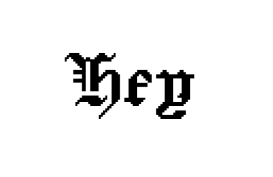

# Script Text SVG Generator

## Description

This application was inspired by a simple problem; I wanted to get a custom vinyl decal with text on it to put on my project car. To do this, I needed an SVG file to send to the vinyl cutter that contained the text I wanted, in a custom font. I thought it would be a fun project to make a CLI application that would automatically create an SVG file for you (**not** a rendered SVG on a web page).

One of the big hurdles for me was trying to integrate the custom Google Font into the file. I had used custom fonts in plenty of other web applications, but that relies on the font platform's API to render itself on the page; I needed to embed it into the file. To get around this, after downloading the TTF file of the font, I had to add a specific `<style>` rule in the `<defs>` of the SVG file: a font-face that included a base64 conversion of the TTF file.

## Installation

Clone the repository and make sure that you have Node.js installed, as well as the dependencies for the index.js file (Inquirer v8.2.4).

## Usage

After cloning the repository and installing any dependencies ( `npm i` ):

Open Git Bash to the application's root folder and run `node index.js`

From there, answer the prompts that appear on the command line. 

After answering the prompts, a new SVG file will appear in the /lib/generated_SVGs foler. You can preview the SVG using Chrome or other web browsers.

Here's an example of what the input of "hey" would look like - 

## Credits

Application designed by me, James Probel

Credit to Sarah Cadigan-Fried for making the font:
https://fonts.google.com/specimen/Jacquard+24?query=Sarah+Cadigan-Fried

Thank you to W3 Schools for guidelines on SVG creation:
https://www.w3schools.com/graphics/svg_intro.asp

Thank you to FontSquirrel for providing a free Webfont Generator:
https://www.fontsquirrel.com/tools/webfont-generator

## Tests

Tests performed for checking the functionality of constructing a new Shape object based on user input.

Please find the test in the "shapes.test.js" file in under the "lib" folder