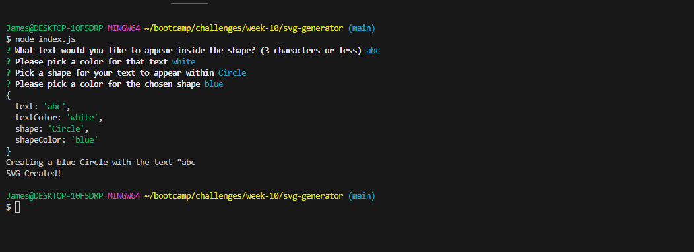
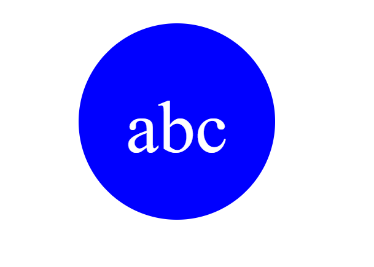

# Simple SVG Logo Generator

## Description

For many, utilizing graphic design can be a daunting task (for myself, included). Say you want to create a simple, custom logo, but the logo has to be infinitely scalable for use in various applications. You'll need a file format called SVG. SVG files, unlike JPG and PNG, use XML data to render an image that can be infinitely zoomed in or out! But how do you go about creating one?

This simple SVG logo generator can help answer that question. Designed to be incredibly user-friendly, this command line application will ask users a few questions about the logo they want to create, and will automatically generate an SVG file based on their input! Find instructions for use down below.

While completing this project, I learned a lot about parameters needed to create various SVG shapes and text rendering. This was also a great exercise in utilizing best practices for creating classes in JavaScript to help reduce code line count. The logic used in those classes was exported as a module to be used in the main index.js file.

## Installation

Clone the repository and make sure that you have Node.js installed, as well as the dependencies for the index.js file (Inquirer v8.2.4, and Jest if you'd like to perform tests).

## Usage

Please watch [this video](https://www.youtube.com/) to get a walkthrough of the application, in addition to the steps below.

After cloning the repository and installing any dependencies:

Open Git Bash to the application folder and run "node index.js"

From there, answer the prompts with your input. 
**Note:** Only input three characters maximum for the first prompt.
**Note:** You can answer questions about desired color with color text (e.g. "blue"), or hexadecimal code

After answering the prompts, a new SVG file "new[shape].svg" will appear in the root folder. This will have the user's desired shape, text, and color scheme. The size for the SVG is 300x200 pixels.

## Credits

Application designed by me, James Probel, with guidelines provided by the UNC Chapel Hill's Programming Bootcamp.

Thank you to W3 Schools for guidelines on SVG creation:
https://www.w3schools.com/graphics/svg_intro.asp

## Tests

Tests performed for checking the functionality of constructing a new Shape object based on user input.

Please find the test in the "shapes.test.js" file in under the "lib" folder